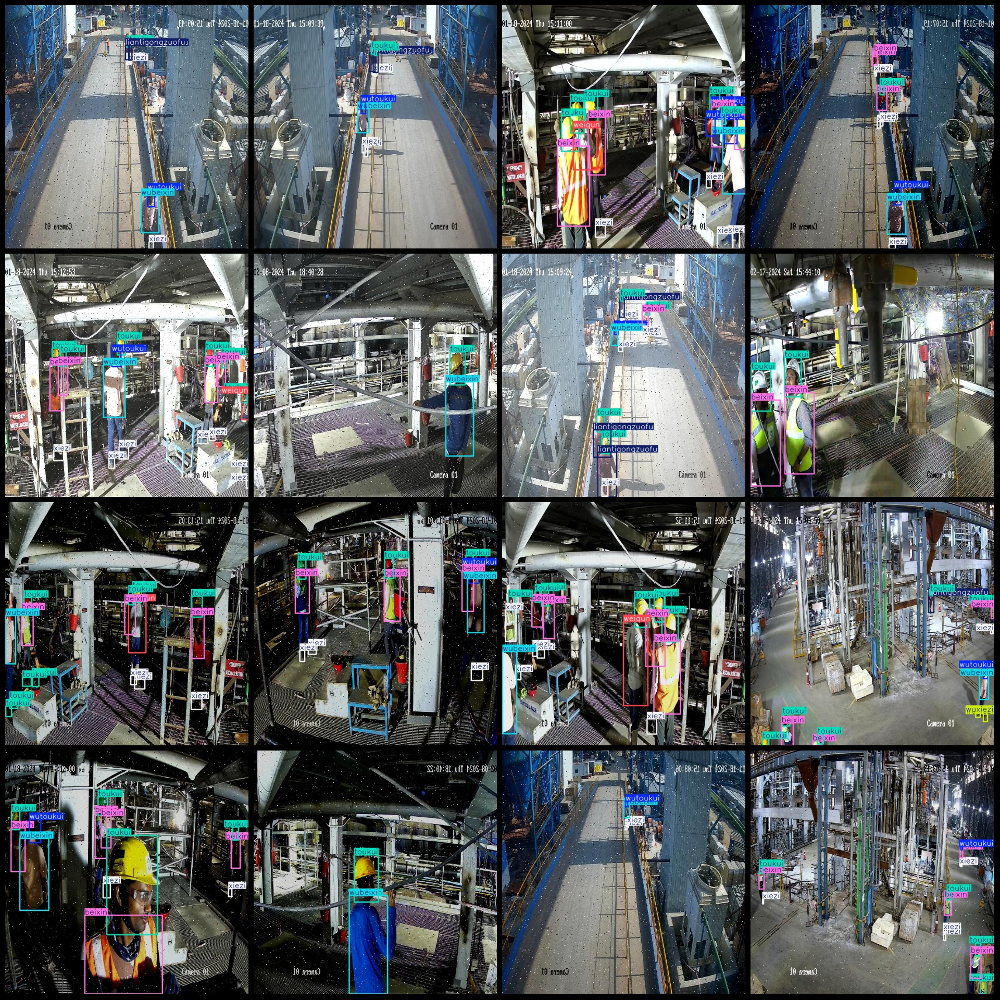
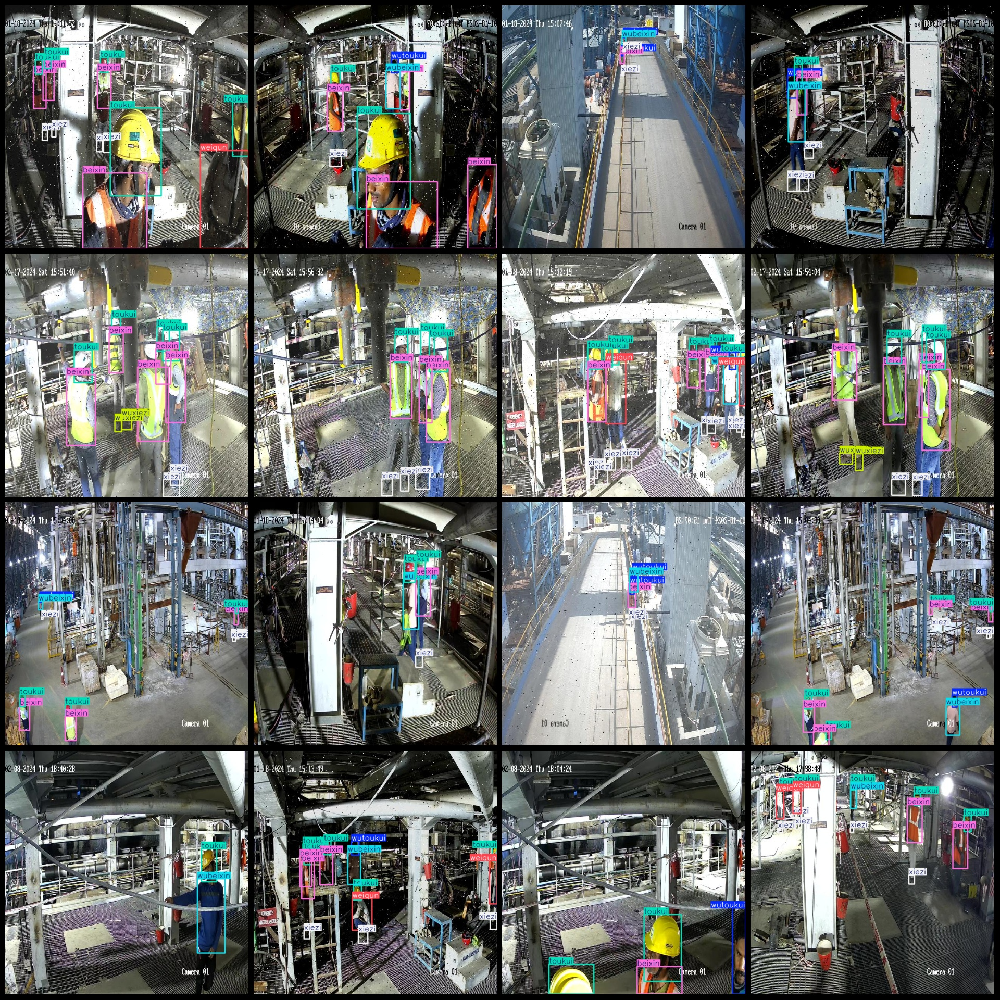

# Smart Factory Area Personnel Safety Protection Detection Dataset - Pascal VOC+YOLO Format - 5389 Images in 9 Categories

Dataset format: Pascal VOC format + YOLO format (excluding split path txt files, only including jpg images along with corresponding VOC format xml files and YOLO format txt files)
Number of images (jpg file counts): 5389
Number of annotations (xml file counts): 5389
Number of annotations (txt file counts): 5389
Number of annotation categories: 9
Annotation category names (note that the order of labels in the YOLO format does not correspond to this list, but is based on the "labels" folder's "classes.txt"): ["beixin", "humujing", 
"liantigongzuofu", "toukui", "weiqun", "wubeixin", "wutoukui", "wuxiezi", "xiezi"]
["T-shirt", "Goggles", "Suit", "Helmet", "Apron", "No T-shirt", "No Helmet", "No Shoes", "No Suit"]
Number of bounding boxes per category:
beixin bounding boxes = 14166
humujing bounding boxes = 132
liantigongzuofu bounding boxes = 1177
toukui bounding boxes = 17215
weiqun bounding boxes = 2835
wubeixin bounding boxes = 4416
wutoukui bounding boxes = 5457
wuxiezi bounding boxes = 1878
xiezi bounding boxes = 19852
Total bounding boxes: 67128
Number of images per category:
beixin images = 4599
humujing images = 131
liantigongzuofu images = 619
toukui images = 4708
weiqun images = 2032
wubeixin images = 4339
wutoukui images = 4301
wuxiezi images = 938
xiezi images = 4622
Image resolution: 640x640
Annotation tool: labelImg
Annotation rules: Draw bounding boxes for categories
Important Notice: The dataset does not include a division into training, validation, or test sets; please divide it yourself.
Special Remark: This dataset does not guarantee any accuracy in the models trained or the weights/files used.
Image previews:
## IMAGE

Here is a pay link on Stripe ( https://buy.stripe.com/3cs8yP7sY87d0vu9AB ). Please contact me lonlonago@foxmail.com after funding $89, and I will send you a complete data files , thank you!

